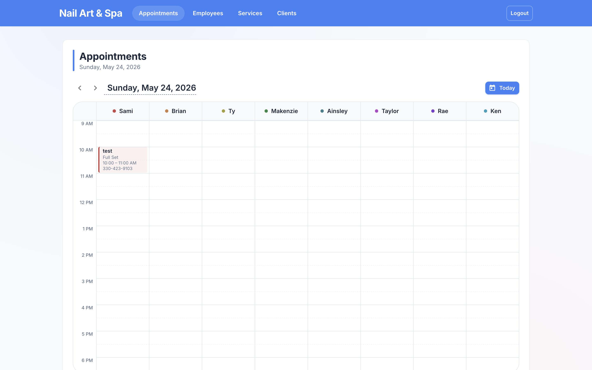
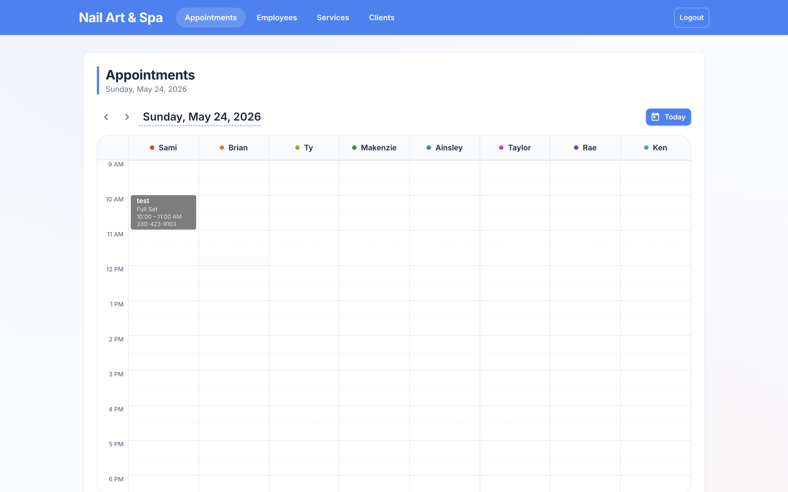
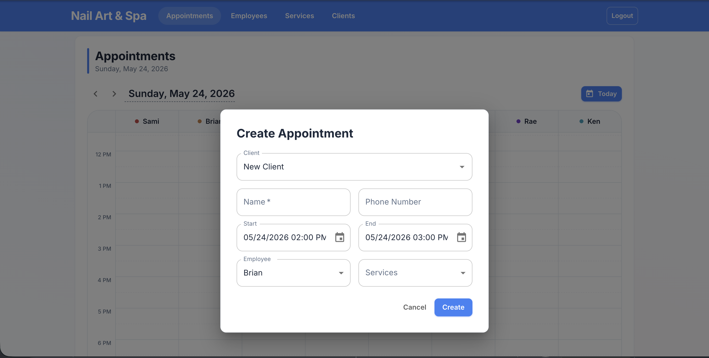
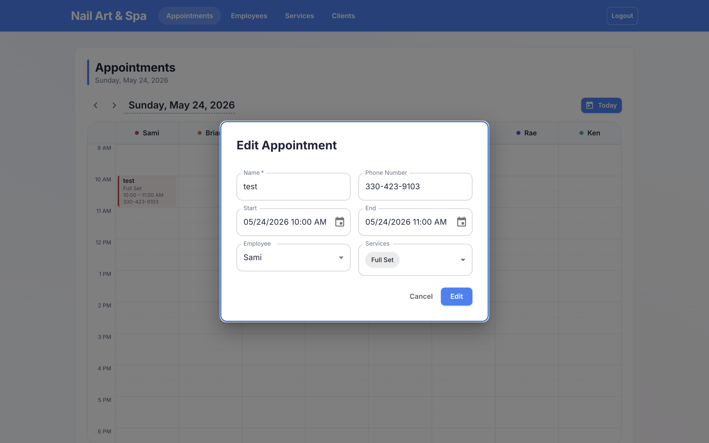
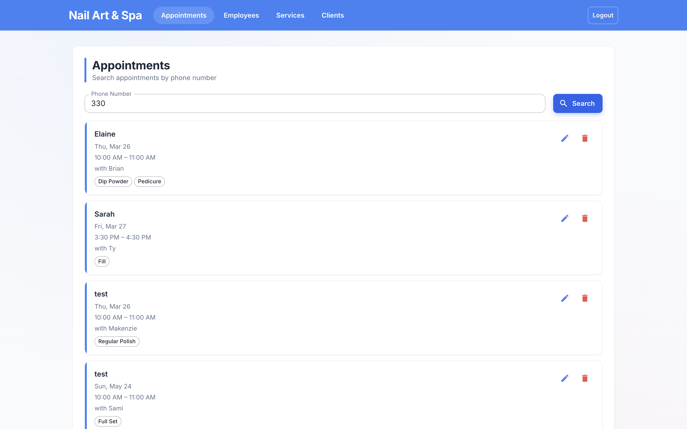
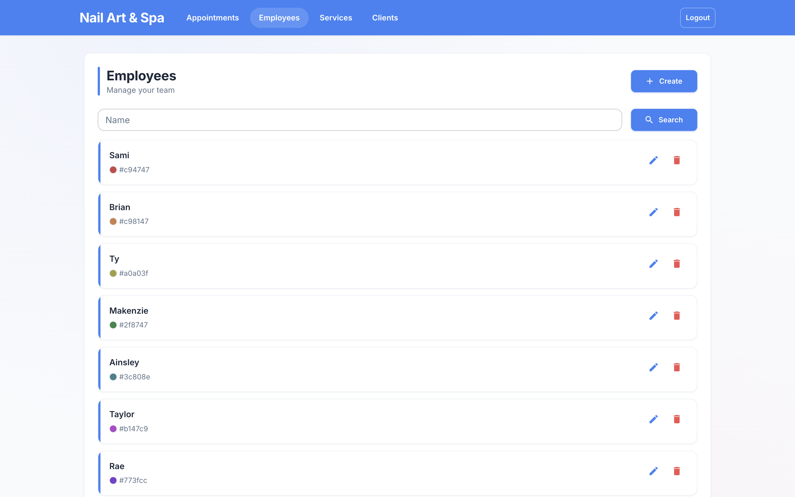
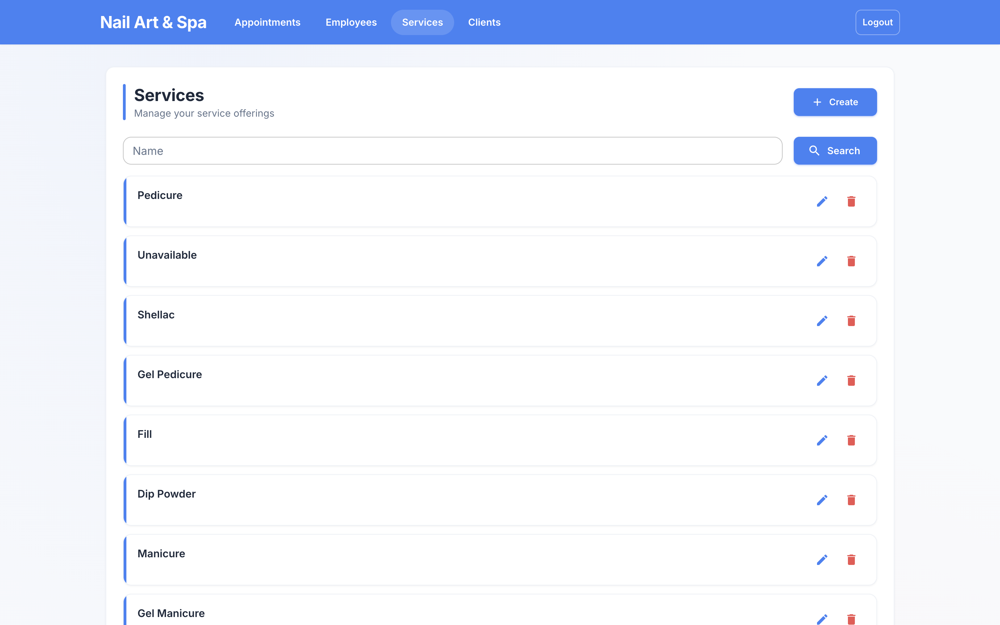
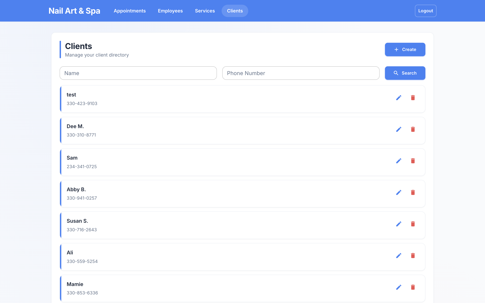

# Nail Art & Spa — Appointment Book

Internal web app that replaces a paper appointment book for Nail Art & Spa LLC. Front desk staff use it to schedule appointments against employee columns, track clients, send reminder texts, and manage employees and services.

The app runs on a daily-use cadence: the calendar is the home page, appointments are created by dragging across an employee's column, and the API blasts SMS reminders to tomorrow's bookings at 3 PM ET every day.

## Screenshots

### Appointments calendar

The calendar is the default view. Columns are employees, rows are 15-minute slots. Click + drag in a column to open the create modal; click an existing appointment for an edit / delete / check-in menu.



Once an appointment is marked as "checked in" / "showed up", it turns gray so the front desk can see who's already in the chair:



### Create / edit appointment

The modal autofills client name and phone number from the clients list. The same modal is reused for edit and delete (with fields disabled in the delete view).




### Appointment search

Partial, case-insensitive phone-number search across appointments. Edit and delete are available inline:



### Employees

CRUD for the salon's employees. Each employee has a color used to coordinate their column on the calendar:



### Services

CRUD for the service menu. Service IDs are referenced by appointments:



### Clients

Searchable client directory. Clients are linked to their appointments by phone number, which drives the autofill in the create modal:



## Tech stack

- **Frontend** (`client/`): [Vite](https://vite.dev) + React 18 + TypeScript, [Material UI](https://mui.com/material-ui/) v7 (`@mui/material`, `@mui/x-data-grid`, `@mui/x-date-pickers`), [TanStack Query](https://tanstack.com/query), `react-router-dom` v6.
- **Backend** (`api/`): [Spring Boot 3](https://spring.io) on Java 21, Spring Security with JWT + refresh-cookie auth, Spring Data JPA, and Flyway. SMS reminders via [Twilio](https://www.twilio.com), plus scheduled appointment archive maintenance.
- **Database**: PostgreSQL 16.

A high-level architecture sketch lives in [`docs/reference/architecture.md`](./docs/reference/architecture.md).

## Quick start

Prerequisites: Node.js 20+, JDK 21, Docker for local PostgreSQL, and optional Twilio credentials.

See [`docs/reference/local-development.md`](./docs/reference/local-development.md) for the full env-var list.

```sh
cd client && npm install && cd ..
just dev                              # runs `just web` + `just api` in parallel
```

The frontend serves at `http://localhost:5173`, the API at `http://localhost:8080`.

There is no public signup. Bootstrap the first organization and owner with `scripts/create_organization.py` and `scripts/bootstrap_organization_owner.py`.

For the published Docker stack:

```sh
./start-app.sh                        # pulls scarletbobcat/nail-art:{client,api} and brings up docker-compose
```

## Repository layout

```
client/   Vite + React + MUI single-page app
api/      Spring Boot 3 REST API + JWT auth + Twilio SMS
scripts/  Python admin/bootstrap scripts
docs/     Canonical documentation (start at docs/INDEX.md)
images/   README screenshots
```

## Documentation

- [`docs/INDEX.md`](./docs/INDEX.md) — full documentation map.
- [`AGENTS.md`](./AGENTS.md) — short router for contributors and AI agents.
- [`docs/reference/architecture.md`](./docs/reference/architecture.md) — system shape, request flow, deployment.
- [`docs/reference/conventions.md`](./docs/reference/conventions.md) — naming and patterns to follow.
- [`docs/reference/lessons.md`](./docs/reference/lessons.md) — gotchas distilled from prior incidents (auth, tenancy, reminders, pagination).
- [`docs/modules/`](./docs/modules) — per-module deep dives: [client](./docs/modules/client.md), [api](./docs/modules/api.md).

## CI

`.github/workflows/ci.yml` runs on every push and PR to `main`:

- Backend: `./mvnw test -Dtest="com.nail_art.appointment_book.services.**"`
- Frontend: `npx tsc -b --noEmit` and `npm run lint`

Run `cd client && npx tsc -b --noEmit` locally before committing frontend changes.

## License

See [`LICENSE`](./LICENSE).
