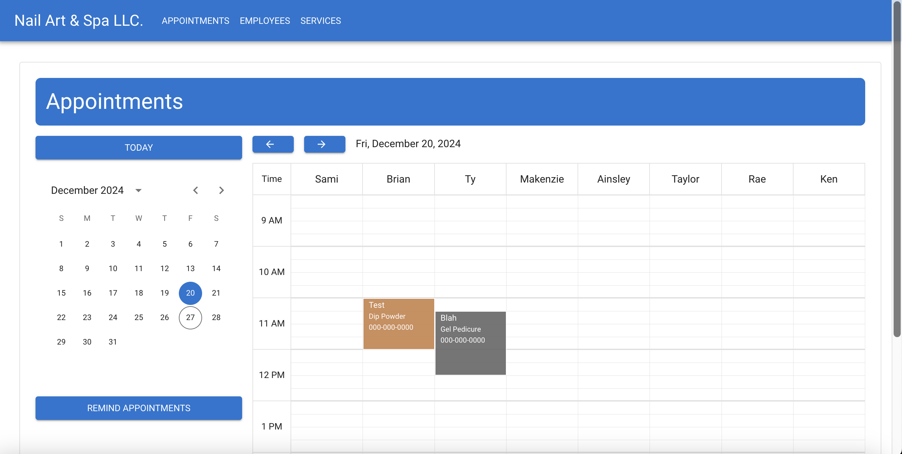
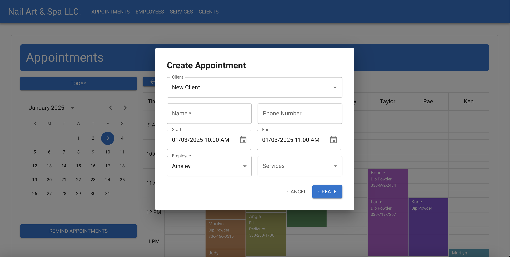

# Nail Art & Spa LLC. Appointment Book Web App

This is an internal application used by Nail Art & Spa LLC. for management of their appointments, employees, and services.

## Technologies

1. Front End
   1. [Vite React + TypeScript](https://vite.dev)
   2. [Material-UI](https://mui.com/material-ui/)
2. Back End
   1. [Java Spring Boot](https://spring.io)
   2. [MongoDB Atlas](https://www.mongodb.com)

## Features

### Appointment Calendar

The main feature of this application is to manage appointments - this includes the basic CRUD (Create, Read, Update, Delete) operations. This is done through a resource calendar type of UI, an example shown below:

The buttons above the calendar is used to change the date by one day, while the navigator to the left can be used to change the date by larger date ranges. The 'Today' button above the navigator changes the date back to the current date.

Another very important feature of this application is actually the 'Remind Appointments' button. This uses Twilio to send SMS messages to every appointment on the next work-day reminding them of their appointment. This saves the business time by not sending each reminder text by hand.

With this page, the user is able to create an appointment by clicking and holding where the appointment will being, and dragging and releasing where they want the appointment to end.

Once the user releases, a modal will open for them to create an appointment where they will be prompted to fill in the necessary fields. It also comes with a client dropdown where the user can search for an existing client and it will autofill their name and phone number:

They will also be able to edit, delete, and mark appointments as 'here' appointments right from this page by left-clicking on an appointment. A menu will appear for the user to choose an option. Once an appointment is marked as 'here', the color of the appointment will turn gray to indicate this. The edit modal is as shown:

The delete appointment modal is exactly the same as the edit modal, the only differences are the title, every field is disabled to prevent the user from changing anything accidentally, and the confirmation button.

### Appointment Search

This page is used to search for appointments by their phone number. The user is also able to edit or delete an appointment on this page using the same modals as the previous one.

### Employees

This page is a simple CRUD page for the employees where the user can do all operations. The color for each employee here is used to coordinate the colors of the appointments on the calendar page.

### Services

Similarly to the employees page, this page is for the services.

### Clients

I've also added a clients page where the user can search, edit, delete, and create clients. These clients are actually linked to their appointments to help with an autofill feature.

